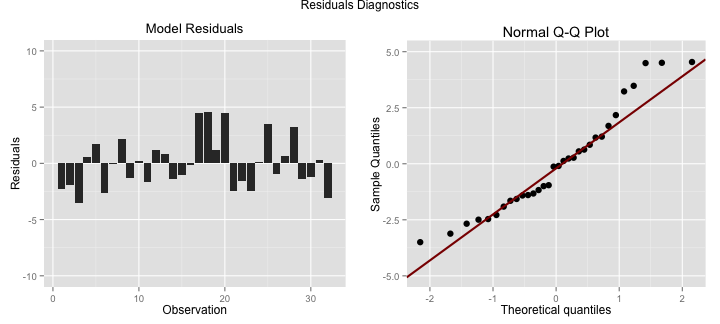

## Summary

<hr>

<b>Application purpose</b>: demonstrate capabilities that <em>Shiny</em> package offers, while exploring properties of Linear Regression.

<b>Features</b>: This is an interactive application created using <i>Shiny</i> platform, allowing users to experiment with selecting variables for Linear Regression model using well-familiar <i>mtcars</i> data set.
* Select any combination of variables to build the regression on
* Receive summary describing model fit quality
* Compare results between different variable selections
* Explore how each variable affects residuals
* See how each variable interacts with miles-per-gallon values

<b>Application location</b>: https://natalia-r.shinyapps.io/CourseProjectApp/

<b>Source code location</b>: 

--- .class #id 

## Inputs and Outputs
<hr>
As shown in the screen shot below, user can select any combination of the variables to be used by lthe linear regression model to predict miles-per-gallon value. The app also offers help in eliminating less important coefficients based on p-value ('Unselect Worst' button).

<div style='text-align: center; '>
    
</div>

On the right side of the screen, the app shows what formula is used in lm() function, and also shows residual standard error and adjusted r-squared values for current and previous runs. It also saves the best fit observed.

---

## Graphs

<hr>
Based on the variables selected in the "Inputs" section, the "Residuals" tab plots residuals for the corresponding model, as well as Q-Q plot. The plot is interactive and allows to see how variable selection affects residuals.


```r
fit <- lm(mpg ~ hp + wt + qsec + am, data=mtcars)
displayResidualsDiagnostics(fit)
```



---

## Why this application is great

<hr>
<br>
* It is created with Shiny
* It is interactive and pretty
* It is educational

## Source of this slides
<hr>
<br>
http://nrodnova.github.com

