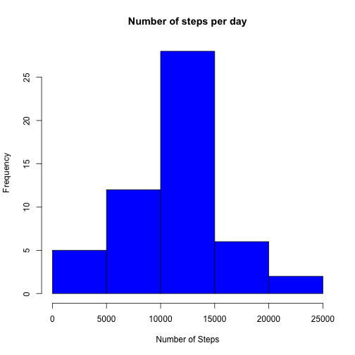
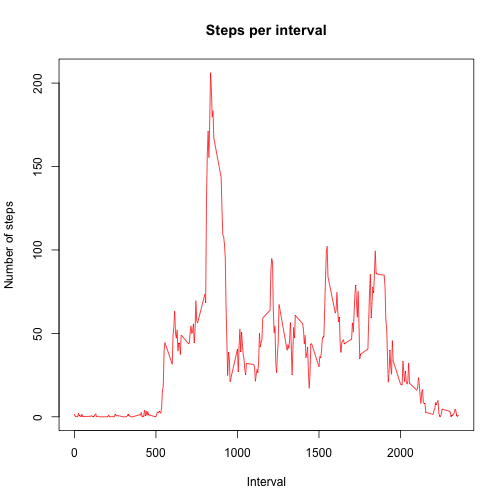
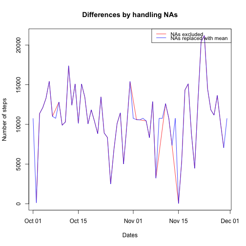
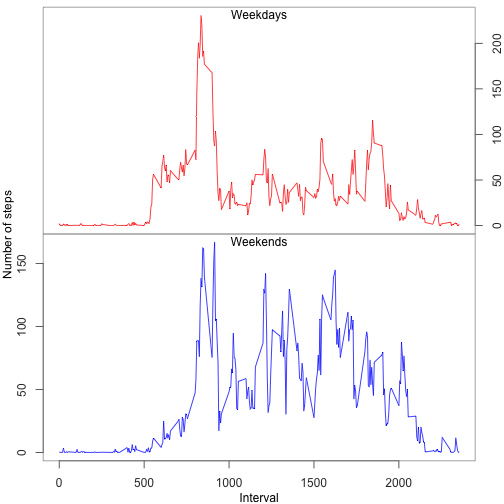

## Loading and preprocessing the data

```r
#Load the data
fileName <- 'activity.csv'
activityRaw <- read.csv(fileName,row.names=NULL)
```


```r
head(activityRaw)
```

```
##   steps       date interval
## 1    NA 2012-10-01        0
## 2    NA 2012-10-01        5
## 3    NA 2012-10-01       10
## 4    NA 2012-10-01       15
## 5    NA 2012-10-01       20
## 6    NA 2012-10-01       25
```


```r
#Convert date and get rid of NAs
activity <- activityRaw
activity$date = as.Date(activityRaw$date, format("%Y-%m-%d"))
activityNoNA <- activity[!is.na(activity$steps),]
```


```r
head(activityNoNA)
```

```
##     steps       date interval
## 289     0 2012-10-02        0
## 290     0 2012-10-02        5
## 291     0 2012-10-02       10
## 292     0 2012-10-02       15
## 293     0 2012-10-02       20
## 294     0 2012-10-02       25
```


## What is mean total number of steps taken per day?

```r
stepsPerDay <- aggregate(activityNoNA$steps, by=list(activityNoNA$date), FUN=sum)
hist(stepsPerDay$x, main="Number of steps per day", xlab = "Number of Steps", col="blue")
```

 


```r
# Mean
mean(stepsPerDay$x)
```

```
## [1] 10766
```


```r
# Median
median(stepsPerDay$x)
```

```
## [1] 10765
```
## What is the average daily activity pattern?

```r
# Calculate average number of steps for each interval
stepsPerInterval <- aggregate(activityNoNA$steps, by=list(activityNoNA$interval), FUN=mean)
#head(stepsPerInterval)
names(stepsPerInterval) <- c('interval', 'steps')

plot(stepsPerInterval$interval, stepsPerInterval$steps, type="l", col="red", main = "Steps per interval", xlab="Interval", ylab = "Number of steps")
```

 


```r
# Max average number of steps achieved per interval:
maxIndex <- which.max(stepsPerInterval$steps)
cat('Max average number of steps per interval: ', stepsPerInterval$steps[maxIndex])
```

```
## Max average number of steps per interval:  206.2
```

```r
cat('Interval number where max number of steps was achieved: ', stepsPerInterval$interval[maxIndex])
```

```
## Interval number where max number of steps was achieved:  835
```

## Inputing missing values

Let's replace missing values in the data set by the calculated earlier mean values of steps within an interval.

```r
# Merge raw data with
activity1 <- merge(activity, stepsPerInterval, by.x = 'interval', by.y = 'interval')
activity1$steps <- activity1$steps.x
activity1$steps[is.na(activity1$steps.x)] <- activity1$steps.y[is.na(activity1$steps)]

# New values :
head(activity1[is.na(activity1$steps.x),])
```

```
##    interval steps.x       date steps.y steps
## 1         0      NA 2012-10-01   1.717 1.717
## 11        0      NA 2012-11-04   1.717 1.717
## 32        0      NA 2012-11-30   1.717 1.717
## 41        0      NA 2012-11-14   1.717 1.717
## 45        0      NA 2012-11-09   1.717 1.717
## 49        0      NA 2012-11-01   1.717 1.717
```

Let's see if mean and median changed after we replaced NA values with average values for corresponding interval:


```r
stepsPerDay1 <- aggregate(activity1$steps, by=list(activity1$date), FUN=sum)
#hist(stepsPerDay1$x, main="Number of steps per day", xlab = "Number of Steps", col="blue")
cat('New mean: ', mean(stepsPerDay1$x), '. Old mean: ', mean(stepsPerDay$x))
```

```
## New mean:  10766 . Old mean:  10766
```

```r
cat('New median: ', median(stepsPerDay1$x), 'Old median: ', median(stepsPerDay$x))
```

```
## New median:  10766 Old median:  10765
```

As we can see, mean remained the same, and median increased by 1.

Plot how daily number of steps has changed after replacing NAs:

```r
plot(stepsPerDay$Group.1, stepsPerDay$x, type="l", col="red", main="Differences by handling NAs", xlab="Dates", ylab="Number of steps")
lines(stepsPerDay1$Group.1, stepsPerDay1$x, col="blue")
legend('topright', y.intersp = 0.6, cex=0.9,lwd=1, col=c("red", "blue"), legend=c("NAs excluded", "NAs replaced with mean"))
```

 

## Are there differences in activity patterns between weekdays and weekends?

```r
# Separate data into weekday and weekend categories:
activity1$day <- rep(NA, length(activity$date))
activity1$day[weekdays(activity1$date) %in% c("Saturday", "Sunday")] = "weekend"
activity1$day[!(weekdays(activity1$date) %in% c("Saturday", "Sunday"))] = "weekday"

stepsPerIntervalWeekday <- aggregate(activity1$steps[activity1$day=="weekday"], by=list(activity1$interval[activity1$day=="weekday"]), FUN=mean)
stepsPerIntervalWeekend <- aggregate(activity1$steps[activity1$day=="weekend"], by=list(activity1$interval[activity1$day=="weekend"]), FUN=mean)
names(stepsPerIntervalWeekday) <- c('interval', 'steps')
names(stepsPerIntervalWeekend) <- c('interval', 'steps')

# Plot the activity patterns using basic plot system:

# Set options for panel plot
par(mfrow=c(2,1))
par(mar = c(0, 0, 0, 0), oma = c(3, 3, 0.5, 2))

# Plot 1 (Weekdays)
plot(stepsPerIntervalWeekday$interval, stepsPerIntervalWeekday$steps, type="l", col="red",  xlab="Interval", ylab = "Number of steps", axes=FALSE)
mtext('Weekdays', line=-1)
axis(4, col="grey20", col.axis="grey20")
box(col = "grey60")

# Plot 2 (weekends)
plot(stepsPerIntervalWeekend$interval, stepsPerIntervalWeekend$steps, type="l", col="blue",  xlab="Interval", ylab = "Number of steps", axes=FALSE)
mtext('Weekends', line=-1)
axis(2, col="grey20", col.axis="grey20")
axis(1, col="grey20", col.axis="grey20")
box(col = "grey60")

mtext('Number of steps',  outer=TRUE, side=2, line=2)
mtext('Interval',  outer=TRUE, side=1, line=2)
```

 

### Conclusion: 
activity pattern on week days and weekends is similar at night (almost none), in the mornings (the highest activity) and in the late evenings (low activity). The main difference is coming from activity during the day, where on weekends it is noticeably higher than on week days. This can be explained by people being more active on weekends while working and thus moving less on week days.
